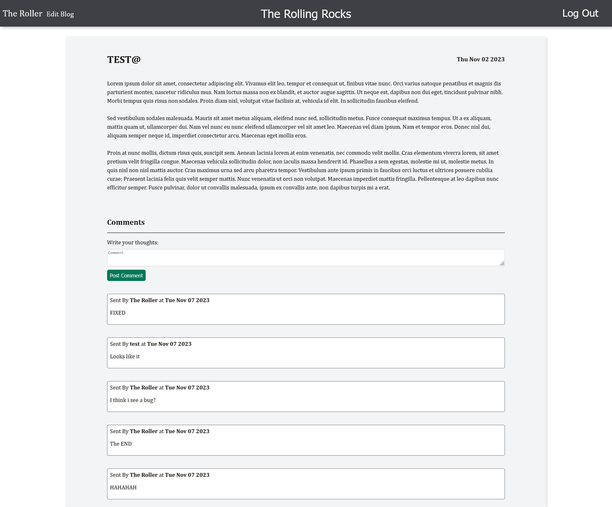

# Blog API with Node and React

This project took me a while to finish, that's for sure.

It simulates a simple blog using Node for the back-end and React for the front-end. Normal users are able to see the blog posts and post comments, while the blog author is able to create and delete posts, as well as leave created posts unpublished if they so desire.

I started this project with the back-end, not really knowing how I would integrate it with the front-end, and that did not take me much time to develop. The hard part, however, came with developing the front-end of the project, as integrating it properly with the back-end was very difficult, especially at the start, as I did not know how to send authentication info to the API. In fact, there were multiple days in which I spent hours searching for some bug that was making it impossible to fetch resources from the back-end. Getting everything working at the end was very satisfying though, thankfully. It also introduced me to Token-based authorization with JWT, which is pretty useful.

Future projects should not be this difficult at least, as I learned A LOT while developing this website. Front-end is a little bit bare bones, but that is because my main goal with this project was to learn and get used to the back-end, as well as its integration with React.

This project is part of the [The Odin Project](https://www.theodinproject.com/) online NodeJS course.